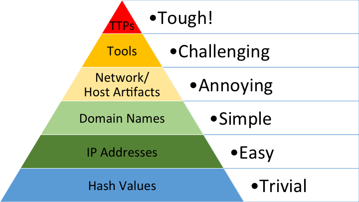

Threat Hunting is the proactive approach of tying to identify existense of any cyber threats within an organizational network that may have evaded and bypassed security controls. It aims to validate the integrity of all systems in an organization. "According to Mandiant the longest time period APT1 (Hacking group) maintained access to a victim’s network was 1,764 days, or four years and ten months." With threat hunting, defenders can uncover advanced threats early thus reducing the attacker's dwell time.

`Dwell time is the time from the point of infiltration to the point of detection.`

### Terminologies 
- Indicators of Compromise(IOC) - "these are artifacts if detected in a network suggests that malicious activity has occured. IOCs as the name suggests infer that you have been compromised."
- Tactics, Techniques and Procedures(TTP) - these are adversary's attack behaviours. Their methodology for gaining access and post-exploitatio activities. Every hacker has their own way of gaining access to a system.

### Threat Hunting vs Threat Detection
Proactivity is the difference between the two. Threat detection is reactive and passive approach to monitor and protect systems based on rules. It can be automated.  On the other hand, Threat Hunting requires human initiative to seach for the attacker. It starts with an hypothesis about potential threats then conducting investigations to vlidate or dismiss those hypothesis.

### Threat Hunting vs Threat Intelligence
Cyber Threat intelligence is an evidence-based information about an actual or developing threat or hazard to assets, including context, processes, indications, consequences, and actionable recommendations. Hunters depend on CTI to categorize potential attacks.

### The Pyramid of Pain
The pyramid of pain is a cyberecurity concept that categorizes different types of indicators that cyber defenders could use to detect adversary's activity according to ther level of difficulty for the attacker to change(the pain you cause the adverary when you deny them to use those indicators while attacking you).  
 

1. **Hash values** - Hash values compute a message to a fixed unique length(MD5, SHA256,..). These indicators are effortless for attackers to change.  With a difference in one bit say an extra space between two files, the resultant hash values are completely different.
2. **Ip Address** - these are common to defenders for detections but they are also relatively simple for attackers to sitch to new adderesses. Attackers often use Proxys and VPN servers making it inexpensive to quickly bouce off and Mask their IP.
3. **Domain Names** - detections on domain names is a first good and higher step to start inflicting pain on the adversary. They are more impactful because the attacker has to register them(it costs money) for their C2 operations. 
4. **Network/Host artifacts** - detecting at this level causes a lot more negative impacts to the attacker. network/Hosts artifacts are more challenging and hard for attackers to evade. A example would be detecting distinctive User agents used by the attacker or files dropped to specific places would force the attacker to recompile and reconfigure their tool everytime they launch an ttack on you.
5. **Tools** - thee are softwares used by attackers during an attack. Detecting at this level increases their costs, time and effort. We force them to recreate and build new tools and perhaps abandon one's that they are way more familliar with impacting their effectiveness.
6. **TTP** - finally when you respond at the attackers behaviors, you cripple them. "You force them to do the most time-consuming thing possible: learn new behaviors." ~ David Bianco